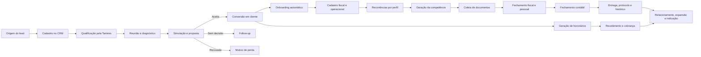
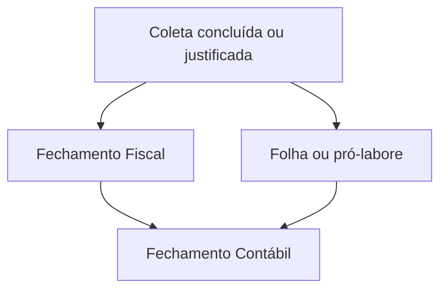

# Regras de negócio e estrutura de processos da Plataforma Futuro

Versão analisada: 10/09/2026  
Empresa: Futuro Contabilidade Digital  
Base da análise: código e documentação presentes em `C:\projetos\codex\sistema escritorio`

## 1. Finalidade do sistema

A Plataforma Futuro organiza o ciclo completo do escritório contábil, desde a entrada do lead até a operação recorrente, cobrança, gestão da equipe e acompanhamento do cliente.

O sistema foi estruturado para cumprir cinco objetivos:

1. Centralizar informações comerciais, cadastrais, operacionais e financeiras.
2. Transformar compromissos do cliente em tarefas com responsável, prazo e checklist.
3. Impedir conclusões sem evidências, etapas obrigatórias ou dependências cumpridas.
4. Manter histórico de alterações e separar acesso por função e departamento.
5. Preparar integrações futuras sem expor credenciais ou presumir que uma conexão externa já está funcionando.

## 2. Estado atual da plataforma

| Área | Estado atual | Observação |
|---|---|---|
| Autenticação local | Funcional | Primeiro sócio cadastra nome, e-mail e senha. Sessão dura oito horas. |
| Dashboard | Funcional | Consolida clientes, tarefas, documentos, honorários, licenças e atividade recente. |
| CRM | Funcional no modo local | Funil, qualificação, reunião, diagnóstico, simulação, propostas, follow-ups e conversão. |
| Clientes | Funcional no modo local | Cadastro completo, consulta OpenCNPJ, responsável e recorrências. |
| Legalização | Funcional no modo local | Processos por etapas e checklists. |
| Tarefas | Funcional no modo local | Avulsas, modelos, recorrências, dependências, evidências e cronômetro. |
| Financeiro | Funcional no modo local | Ativação por cliente, contas a receber automáticas, contas a pagar, geração mensal e BI financeiro. |
| Contábil | Parcial | Plano de contas e contas por cliente estão disponíveis. Conciliação e exportação Alterdata ainda são especificação. |
| Atendimento | Conexão local preparada | Credenciais cifradas, consulta de status e QR Code pela Z-API. Webhook HTTPS ainda depende da publicação. |
| Documentos | Funcional no modo local | Arquivos privados de até 10 MB. |
| Portfólio | Funcional no modo local | Catálogo, preço, unidade, escopo e histórico de preço. |
| Escritório | Funcional no modo local | Equipe, sistemas, metas, cargos e avaliações. |
| Supabase | Preparado, não implantado | Migração, RLS e Edge Function existem, mas não foram aplicados em projeto remoto. |
| Integrações externas | Não configuradas | Z-API, Cora, Alterdata, eContador, NF Stock, Veri, NFS-e, Google Workspace e assinatura digital. |

## 3. Visão do processo completo

## 4. Papéis, departamentos e responsabilidades

### 4.1 Papéis de acesso

| Papel | Regra principal |
|---|---|
| Sócio | Acesso integral. Administra usuários, permissões, catálogo, configurações e dados sensíveis. |
| Operação | Executa registros permitidos e enxerga tarefas do próprio departamento ou sob sua responsabilidade. |
| Administrativo | Atua principalmente em CRM, atendimento, coleta e rotinas administrativas. |
| Leitura | Consulta o conteúdo autorizado, sem criar, alterar, excluir ou executar comandos. |

### 4.2 Distribuição inicial da equipe

| Pessoa | Papel cadastrado | Escopo inicial |
|---|---|---|
| Gilmar Santos | Sócio | Todos os departamentos e decisões administrativas. |
| Daniel Branquinho | Operação | Fiscal, Pessoal, Contábil, Paralegal e Legalização. |
| Tamires | Administrativo | Administrativo e Comercial. |

### 4.3 Regras de autorização

- Somente sócio altera equipe, cargos, avaliações, serviços, integrações, sistemas e configurações.
- Financeiro exige que o usuário pertença ao departamento Financeiro, salvo o sócio.
- Leads e propostas exigem perfil administrativo ou acesso ao departamento Comercial, salvo o sócio.
- Documentos com departamento definido só aparecem para pessoas autorizadas naquele departamento.
- Tarefas e processos operacionais aparecem quando pertencem ao departamento do usuário ou estão atribuídos a ele.
- Avaliações aparecem ao próprio colaborador e ao sócio.
- Salários, faixas salariais e configurações classificadas como segredo ou credencial são ocultados dos demais perfis.
- O último sócio ativo não pode ser desativado.
- A simples existência de um colaborador não cria uma conta de acesso. Conta, e-mail, senha, papel e vínculo com a equipe são registros próprios do servidor.

## 5. Regras gerais de dados e segurança

### RN-GER-01: persistência local

O estado de negócio é salvo em PostgreSQL embarcado com PGlite, na pasta privada `.local-data`. A interface não acessa o banco diretamente.

### RN-GER-02: concorrência

Toda alteração usa a revisão atual do estado. Se outra tela salvar antes, a tentativa seguinte recebe conflito e precisa atualizar os dados antes de reenviar.

### RN-GER-03: auditoria

Criações, alterações, exclusões, conclusão de tarefas, avanço de processos, geração de recorrências, transferência de responsáveis, consulta de CNPJ e eventos de segurança deixam registro de auditoria.

### RN-GER-04: histórico imutável

A coleção de atividades não pode ser alterada ou excluída pelos comandos comuns.

### RN-GER-05: referências

Cliente, responsável, lead, proposta, serviço, processo, tarefa e documento vinculados precisam existir antes da gravação.

### RN-GER-06: segredos

Senhas, tokens, chaves de API, credenciais e equivalentes são recusados nos registros comuns. Devem ficar no cofre cifrado.

### RN-GER-07: arquivos

- Limite atual: 10 MB por arquivo.
- Armazenamento: fora da pasta pública.
- Nome físico: aleatório.
- Download: exige sessão e autorização.
- Entrega: como anexo, com cache desativado.

### RN-GER-08: cofre

Os segredos são cifrados com AES-256-GCM. A chave local `vault.key` precisa acompanhar o backup protegido. Toda revelação de segredo é auditada.

### RN-GER-09: exclusão

O sistema atualmente permite excluir registros autorizados, mas ainda não bloqueia todas as exclusões que possam deixar registros dependentes sem referência. Esta proteção deve ser reforçada antes do uso em produção compartilhada.

## 6. Processo comercial e CRM

### 6.1 Funil comercial

1. Lead
2. Qualificação
3. Reunião agendada
4. Diagnóstico
5. Proposta enviada
6. Negociação
7. Fechado ganho
8. Fechado perdido

### 6.2 Entrada da oportunidade

Uma oportunidade deve possuir, no mínimo:

- Nome do contato.
- Origem.
- Responsável.

Novos leads recebem automaticamente:

- Etapa: Lead.
- Temperatura: Morno.
- Qualidade: Não qualificado.
- Proposta: Não gerada.

As origens disponíveis são indicação, programa de indicação, BNI, networking, WhatsApp, Google Meu Negócio, Instagram, site, tráfego pago, cliente antigo e outro.

### 6.3 Qualificação antes da reunião

A Tamires registra respostas por seleção e campos curtos. O objetivo é preparar a reunião sem criar um formulário pesado para o lead.

O cadastro reúne:

- CNPJ e regime atual.
- Segmento, CNAE e localização.
- Faturamento médio.
- Sócios, pró-labore e funcionários.
- Volume e tipo de notas.
- Certificado digital.
- Contador atual e honorário.
- Principal dificuldade.
- Débitos, parcelamentos, alvarás e licenças.
- Motivo da busca, urgência, decisor e prazo de mudança.
- Qualidade, temperatura, objeção provável e oferta recomendada.

Ao salvar a qualificação, o sistema gera um resumo para o contador e pode posicionar a oportunidade em Reunião agendada.

### 6.4 Mapa da reunião

O roteiro é dividido em blocos pré-preenchidos. Cada pergunta recebe:

- Anotação da resposta.
- Situação: Pendente, Respondido ou Não se aplica.
- Confirmação de conclusão do bloco.

O registro deve separar fato informado, risco ainda não confirmado, perda estimada, oportunidade e próximo passo.

### 6.5 Diagnóstico

O diagnóstico classifica:

- Dor principal.
- Urgência.
- Qualidade e temperatura.
- Objeção provável.
- Oferta recomendada.
- Dores e consequências.
- Riscos.
- Perdas estimadas com premissas.
- Oportunidades.
- Prontidão de compra.
- Próximo passo.

Nenhuma economia tributária deve ser registrada como garantida. Riscos sem documentos permanecem como hipótese.

### 6.6 Simulação de honorários

A simulação usa versão de tabela registrada e guarda a composição do preço.

Fórmula:

`Preço = base do plano + faixa de faturamento + critérios operacionais + serviços extras`

Bases dos planos:

| Plano | Acréscimo base |
|---|---:|
| Essencial | R$ 0,00 |
| Mentor | R$ 100,00 |
| Estratégico | R$ 560,00 |

Critérios adicionais incluem colaboradores, pró-labore, contas financeiras, ponto, DIFAL, emissão de notas, contas a pagar, ICMS-ST, monofásicos e nível de integração.

Regras:

- Serviço extra precisa existir e estar ativo no catálogo.
- O preço do extra precisa ser o preço vigente do catálogo.
- Serviço com valor zero exige aprovação explícita do sócio.
- A tabela de Indústria não foi fornecida e a simulação deve permanecer bloqueada.
- Faturamento acima da última faixa exige parametrização aprovada.
- O valor calculado é honorário comercial, não cálculo de tributos.

### 6.7 Proposta

Estados disponíveis:

1. Gerada
2. Enviada
3. Visualizada
4. Em negociação
5. Aceita
6. Recusada

Regras:

- A proposta exige lead, plano, validade, condição de pagamento, responsável e valor.
- Marcar como enviada exige comprovante de envio ou identificador externo.
- Alterar a situação exige uma observação e confirmação de que ela corresponde ao ocorrido.
- Registrar Enviada não envia mensagem automaticamente.
- Apenas proposta Aceita libera a conversão em cliente.
- Uma proposta aberta há mais de 48 horas sem envio aparece em alerta.

### 6.8 Follow-up

Cadência sugerida:

- D+2: confirmar recebimento.
- D+4: tratar dúvidas.
- D+7: solicitar decisão ou combinar nova data.
- D+14: encerrar ou reativar no período combinado.

Todo follow-up é uma tarefa comercial com responsável, prazo, prioridade e vínculo com o lead.

### 6.9 Conversão

A conversão executa uma transação lógica única:

1. Valida que o lead ainda não foi convertido.
2. Exige honorário mensal maior que zero.
3. Exige cadastro operacional do cliente e recorrências confirmadas.
4. Cria o cliente ativo.
5. Cria o processo de onboarding.
6. Marca o lead como Fechado ganho.
7. Registra os eventos no histórico.

## 7. Cadastro e gestão de clientes

### 7.1 Dados do cliente

O cadastro preserva todos os dados em um fluxo guiado de oito etapas:

1. Identificação da empresa, iniciada pela consulta do CNPJ.
2. Contato, origem, responsável e endereço.
3. Perfil fiscal e operacional.
4. Documentos, canais de fechamento e entregáveis.
5. Contrato, honorários e representante legal.
6. Acompanhamento, integração, riscos e orientações internas.
7. Tarefas recorrentes, responsáveis e prazos.
8. Revisão dos dados principais antes de salvar.

Os dados permanecem no mesmo cadastro do cliente. A divisão em etapas altera somente a experiência de preenchimento e não reduz o conteúdo armazenado.

Para preparar a futura geração de contratos, o cadastro também registra:

- Sócio ou representante legal.
- CPF do representante.
- E-mail para assinatura.
- Cargo ou qualificação do representante.

Esses quatro campos ainda são opcionais para salvar o cliente. A revisão final informa quando faltam dados necessários para gerar o contrato futuramente.

Na criação, etapas futuras ficam bloqueadas até a validação dos campos obrigatórios da etapa atual. Na edição, todas as etapas ficam disponíveis para acesso direto. O sistema preserva os valores informados ao avançar ou voltar.

### 7.2 Consulta pública de CNPJ

O usuário informa o CNPJ e solicita a consulta. O servidor chama a OpenCNPJ com o dataset Receita Federal e pode preencher:

- Razão social e nome fantasia.
- Situação e data cadastral.
- Natureza jurídica.
- E-mail e telefones.
- Data de abertura.
- CNAE principal e secundários.
- Porte e capital social.
- Endereço.
- Quadro societário público.

Regras:

- A consulta exige usuário autenticado.
- O servidor chama somente o endereço fixo configurado da OpenCNPJ.
- O CNPJ aceita 14 caracteres e está preparado para formato alfanumérico.
- A consulta não salva o cliente automaticamente.
- O usuário deve revisar os dados antes de salvar.
- Regime e atividade ficam sem seleção quando a fonte não os confirma.
- Dados públicos processados não substituem comprovante oficial, análise jurídica ou validação fiscal.

### 7.3 Ativação

Um cliente com status Ativo precisa ter:

- Razão social ou nome.
- Origem.
- Honorário maior que zero.
- Responsável válido.
- Pelo menos uma recorrência ou justificativa de dispensa.
- Recorrências revisadas e confirmadas.

O dia de vencimento deve estar entre 1 e 31.

### 7.4 Responsável e transferência

Cada cliente possui um responsável principal. Cada recorrência também possui responsável próprio.

Ao trocar responsáveis, o usuário pode solicitar a transferência das tarefas recorrentes pendentes. O sistema transfere somente tarefas:

- Do mesmo cliente.
- Geradas a partir de modelo recorrente.
- Ainda não concluídas.
- Cujo modelo corresponde a uma regra atual do cliente.

Tarefas avulsas e concluídas permanecem com o responsável anterior.

### 7.5 Jornada do cliente

1. Boas-vindas: dia 0.
2. Onboarding e implantação: dia 1.
3. Ativação: dia 1.
4. Acompanhamento inicial: dia 30.
5. Relacionamento: dia 35.
6. Fidelização: dia 35.
7. Expansão de serviços: dia 36.
8. Pedido de indicação: dia 37.

Esses marcos estão cadastrados como referência. A automação automática da jornada ainda não está conectada.

### 7.6 Inteligência da carteira

A tela de clientes oferece visões operacionais inspiradas na base atual do escritório:

- Tabela completa.
- Enquadramento por regime tributário, porte, atividade e plano.
- Distribuição por estado e cidade.
- Onboarding dos primeiros 90 dias.
- Vendas e entradas por mês, honorário, grupo e origem.

O onboarding do BI começa na data de entrada do cliente ativo e é dividido em 0 a 30, 31 a 60 e 61 a 90 dias. No 91º dia, o cliente sai automaticamente dessa visão, sem alteração do cadastro ou do processo operacional.

## 8. Recorrências e operação mensal

### 8.1 Regra de recomendação

Toda recomendação precisa ser revisada. O sistema sugere e marca as tarefas aplicáveis, mas permite desmarcar exceções e adicionar outras.

Base comum:

- Coleta de documentos.
- Fechamento Fiscal.
- Fechamento Contábil.
- Balanço patrimonial e demonstrações.

Por regime:

| Condição | Recorrências acrescentadas |
|---|---|
| MEI | DAS-MEI e DASN-SIMEI |
| Simples Nacional | PGDAS-D e DAS, DEFIS |
| Lucro Presumido ou Lucro Real | PIS e COFINS, IRPJ e CSLL, EFD Contribuições, ECF e ECD |

Por perfil:

| Condição | Recorrências acrescentadas |
|---|---|
| Possui funcionários | Folha, eSocial, FGTS Digital, DCTFWeb e 13º |
| Somente pró-labore | Pró-labore, eSocial e DCTFWeb |
| Possui retenções | EFD-Reinf |
| Comércio ou Indústria com inscrição estadual | EFD ICMS/IPI e GIA conforme UF |
| Serviços | ISS e declaração municipal de serviços |
| Plano Mentor ou Estratégico | Relatório gerencial, Fator R, CNDs e planejamento tributário |
| Plano Estratégico | Reunião de resultados e análise de precificação |

### 8.2 Cadastro da recorrência

Cada regra exige:

- Modelo.
- Periodicidade igual à do modelo.
- Responsável existente.
- Dia de vencimento entre 1 e 31.
- Mês válido para recorrência anual.

Sem regras, o usuário precisa registrar uma justificativa de dispensa.

### 8.3 Geração da competência

1. Selecionar cliente ativo e competência no formato AAAA-MM.
2. Validar as recorrências confirmadas.
3. Ignorar tarefa já existente para o mesmo cliente, modelo e competência.
4. Gerar mensais em qualquer mês.
5. Gerar trimestrais somente nos meses 3, 6, 9 e 12.
6. Gerar anuais somente no mês configurado.
7. Ajustar o vencimento ao último dia do mês quando o dia configurado não existir.
8. Criar checklist pendente conforme o modelo e o perfil do cliente.

### 8.4 Catálogo de tarefas

| Departamento | Modelos existentes |
|---|---|
| Administrativo | Coleta de documentos, revisão cadastral, revisão de licenças e certificados |
| Fiscal | Fechamento Fiscal, DAS-MEI, DASN-SIMEI, PGDAS-D e DAS, DEFIS, PIS e COFINS, IRPJ e CSLL, EFD Contribuições, EFD-Reinf, EFD ICMS/IPI, GIA, ISS, declaração municipal, Fator R, CNDs e planejamento tributário |
| Pessoal | Programação de férias, Folha, pró-labore, eSocial, FGTS Digital, DCTFWeb e parcelas do 13º |
| Contábil | Fechamento Contábil, ECF, ECD, relatório gerencial, reunião de resultados e demonstrações |
| Financeiro | Conciliação bancária, contas a pagar, contas a receber e análise de precificação |

## 9. Execução e conclusão de tarefas

### 9.1 Criação

Uma tarefa exige:

- Nome.
- Tipo de demanda.
- Cliente.
- Departamento.
- Responsável.
- Prazo.
- Prioridade.
- Competência quando aplicável.

Nova tarefa começa Pendente e com todos os passos pendentes. Tarefas avulsas recebem checklist personalizado; tarefas por modelo recebem checklist padrão.

### 9.2 Checklist

- Cada passo precisa de identificador, descrição e estado.
- Checklist só pode ser alterado pela ação própria de marcar passo.
- O passo pode receber anexo, valor e justificativa.
- Uma tarefa concluída fica bloqueada para alterações de execução.

### 9.3 Dependências

Regras:

- Fiscal, Folha e Pró-labore dependem da Coleta da mesma competência.
- A Coleta pode ser dispensada somente com justificativa de pelo menos 10 caracteres.
- Fechamento Contábil depende do Fechamento Fiscal.
- Se o cliente possuir funcionários, pró-labore ou recorrência trabalhista, o Contábil também depende da Folha ou do Pró-labore.

### 9.4 Conclusão

- Todos os passos obrigatórios precisam estar concluídos.
- Obrigações marcadas com exigência de protocolo precisam ter protocolo e recibo anexado.
- O recibo precisa existir e pertencer ao cliente quando houver vínculo.
- As dependências da competência precisam estar cumpridas.
- A conclusão registra data, autor e evento de auditoria.

## 10. Processos de legalização

### 10.1 Regra geral

Novo processo começa na primeira etapa, com status Em andamento e todos os itens pendentes. Etapa e status final não podem ser alterados por edição comum.

Para avançar:

1. Concluir todos os itens obrigatórios da etapa atual.
2. Anexar evidências quando o item exigir.
3. Acionar Avançar etapa.
4. Na última etapa, o processo muda para Concluído.

### 10.2 Modelos existentes

| Processo | Etapas |
|---|---|
| Abertura de empresa | Dados dos sócios, dados da empresa, documentação, análise, registro, alvarás, SEFAZ e Prefeitura, finalização |
| Desenquadramento de MEI para LTDA | Portal do Simples, Junta, viabilidade, DBE, FCN, taxa, contrato, assinatura, análise, Prefeitura e SEFAZ |
| Alteração de endereço em Goiânia | Documentos, uso do solo, cobrança inicial, início, contrato, protocolo e pós-Junta |
| Baixa de CNPJ | Pré-requisitos, execução e finalização |
| Onboarding de cliente | Contrato, acessos e sistemas, integração |
| Alvará ou licença | Preparação, execução e entrega |
| Certificado digital | Preparação, emissão e entrega |

### 10.3 Onboarding criado pela conversão

Contrato:

1. Confeccionar contrato.
2. Cadastrar na assinatura digital.
3. Enviar para assinatura.
4. Confirmar assinatura.
5. Salvar na pasta do cliente.

Acessos e sistemas:

1. Fazer procuração e-CAC.
2. Cadastrar em Alterdata, eContador, NF Stock e Veri.
3. Cadastrar no sistema de cobrança.

Integração:

1. Agendar reunião de onboarding.
2. Enviar boas-vindas e manuais.
3. Agendar treinamento.

## 11. Atendimento

O fluxo previsto é:

1. Receber mensagem pela integração.
2. Identificar ou vincular o cliente.
3. Registrar conversa e mensagens.
4. Resolver no atendimento ou transformar mensagem em tarefa.
5. Definir departamento, responsável, prazo e prioridade.
6. Acompanhar a tarefa até a entrega.

Uma mensagem só vira tarefa quando possui conteúdo e cliente válido. A tarefa recebe checklist mínimo de executar e conferir.

### 11.1 Conexão do WhatsApp por QR Code

1. O sócio informa o ID da instância, token da instância e Client Token da Z-API.
2. O servidor cifra as três credenciais no cofre local.
3. O navegador recebe apenas o estado da conexão e a imagem temporária do QR Code.
4. O usuário abre WhatsApp Business, acessa Aparelhos conectados e lê o QR Code.
5. O sistema consulta o estado da instância e confirma a conexão.
6. O QR Code é renovado a cada 15 segundos, por no máximo três tentativas. Depois disso, exige ação manual para gerar um novo código.

O sistema não grava tokens no cadastro geral, não retorna segredos ao navegador e não exibe um QR Code inventado quando a Z-API está indisponível.

### 11.2 Limites operacionais

- A conexão usa a instância Z-API e exige uma conta ativa nesse serviço.
- A tela não habilita disparos em massa.
- A conexão por QR não importa conversas por si só.
- O recebimento de mensagens na caixa de entrada exige webhook HTTPS publicado.
- Mensagens recebidas devem ser vinculadas ao cliente antes de gerar tarefa.

Estado atual: configuração protegida, consulta de status e geração de QR Code estão implementadas. Webhook de recebimento e envio de mensagens continuam pendentes da publicação HTTPS e da configuração da instância.

## 12. Financeiro do escritório

### 12.1 Contas a receber

Uma fatura exige cliente, competência, vencimento, status e valor maior que zero.

Tipos:

- Honorário.
- Serviço extra.

Status de tela:

- Pendente.
- Pago.
- Cancelado.

### 12.2 Geração de honorários

No cadastro do cliente, o financeiro e a cobrança recorrente vêm habilitados. A competência inicial também é informada no cadastro.

Ao salvar um novo cliente ativo:

1. Validar honorário, dia de vencimento e competência inicial.
2. Criar a primeira conta a receber com status Pendente.
3. Registrar a origem como Cadastro automático.
4. Impedir duplicidade por cliente, competência e tipo Honorário.

Na geração mensal:

1. Selecionar competência.
2. Localizar clientes ativos com financeiro e cobrança recorrente habilitados.
3. Validar honorário maior que zero.
4. Ignorar honorários já existentes para a mesma competência.
5. Usar o dia de vencimento do cliente, limitado ao último dia do mês.
6. Criar somente as contas pendentes que faltam.

O usuário pode desabilitar o financeiro ou a cobrança automática no cadastro. Nenhuma dessas ações envia boleto, e-mail ou mensagem. O envio externo depende de integração ativa e confirmação própria.

### 12.3 Contas a pagar

Uma despesa exige descrição, fornecedor, categoria, competência, vencimento, status e valor maior que zero.

Categorias: pessoal, sistemas, marketing, infraestrutura, tributos, serviços de terceiros e outros.

### 12.4 Indicadores

- Receita recorrente mensal contratada.
- Faturado e recebido na competência.
- Percentual recebido sobre o faturado.
- Contas pendentes e inadimplência.
- Despesas cadastradas e pagas.
- Resultado de caixa: recebido menos despesas pagas.
- Resultado projetado: faturado menos despesas cadastradas.
- Tendência de receitas e custos dos últimos seis meses.
- Contas a receber por situação e despesas por categoria.
- Clientes com valores vencidos.

A margem é gerencial e preliminar. Não representa conciliação bancária nem resultado contábil completo.

## 13. Contábil e conciliação bancária

### 13.1 Funcional agora

- Upload privado de plano de contas em PDF, CSV, XLS, XLSX ou TXT.
- Vínculo obrigatório do plano ao cliente e à versão.
- Cadastro de contas sintéticas e analíticas.
- Código único dentro da mesma versão.
- Uma conta só pode pertencer ao mesmo cliente do plano.
- Um plano Ativo precisa possuir ao menos uma conta analítica ativa.
- Ao ativar nova versão, o plano ativo anterior do mesmo cliente vira Substituído.
- Planos e contas de clientes diferentes não são compartilhados.

Estados do plano:

1. Em análise
2. Ativo
3. Substituído
4. Rejeitado

### 13.2 Especificado, ainda não implementado

- Leitura automática do plano de contas.
- Importação OFX, CSV, XLS e XLSX.
- Perfis por banco e validação de saldos.
- Importação do razão.
- Conciliação 1:1, 1:N, N:1 e N:N.
- Regras de classificação por cliente.
- Sugestões de lançamentos.
- Revisão e aprovação contábil.
- Exportação XLS compatível com Alterdata.
- Manifesto, hash e confirmação de importação no Alterdata.

Regra central: nenhuma sugestão pode usar conta de outro cliente, conta inexistente, conta sintética ou versão substituída. Sugestão não equivale a lançamento aprovado.

## 14. Portfólio e gestão de preços

Cada serviço registra:

- Nome, categoria e descrição.
- O que inclui e não inclui.
- Pré-requisitos.
- Preço e unidade de cobrança.
- Departamento e prazo interno.
- Situação ativa.
- Instrução de trabalho.

Quando o preço muda, a versão aumenta e o histórico conserva valor, data e autor. Propostas antigas mantêm a versão do preço usada na simulação.

## 15. Gestão do escritório

### Equipe

Cadastro de cargo, departamento, gestor, contatos, datas, custo por hora e responsabilidades.

### Sistemas

Cadastro de ferramenta, link, setor, situação, custo mensal, vencimento, responsável e suporte.

### Metas

Cada meta possui objetivo, resultado-chave, responsável, valor atual, valor-meta, unidade e prazo.

Meta inicial registrada: 100 clientes ativos até 31/12/2026. O progresso usa apenas clientes presentes na plataforma.

### Cargos e salários

Cadastro de nível, departamento, degrau, faixa salarial, benefícios, responsabilidades, requisitos e critérios de promoção.

### Avaliações

Registro de competências, resultado, plano de desenvolvimento, próxima avaliação e elegibilidade para promoção.

## 16. Dashboard e indicadores

O painel calcula:

- Clientes ativos.
- Honorário recorrente mensal cadastrado.
- Tarefas pendentes, urgentes e concluídas.
- Percentual de entregas no prazo.
- Documentos recebidos nos últimos 30 dias.
- Licenças ativas que vencem nos próximos 90 dias.
- Atividades das últimas 48 horas.
- Progresso da meta de clientes.

Os indicadores são derivados dos registros atuais. Dados não cadastrados não são estimados.

## 17. Arquitetura técnica

### 17.1 Edição local em uso

- Frontend: React 19, Vite 8 e TypeScript.
- Interface: Tailwind CSS, componentes próprios e Radix Slot.
- Servidor: Node com API HTTP local.
- Banco: PostgreSQL embarcado PGlite.
- Endereço: `127.0.0.1:4318`.
- Dados: `.local-data/database`.
- Documentos: `.local-data/documents`.
- Chave do cofre: `.local-data/vault.key`.

Tabelas técnicas locais:

1. `accounts`
2. `sessions`
3. `app_states`
4. `files`
5. `vault_secrets`
6. `security_events`

As coleções de negócio ficam dentro do estado versionado da organização.

### 17.2 Caminho remoto preparado

- Supabase PostgreSQL.
- Supabase Auth.
- RLS em todas as tabelas.
- Edge Function `futuro-api`.
- Storage privado.
- Isolamento por `organizacao_id`.

Esse caminho ainda não foi implantado nem homologado. O frontend atual continua usando o servidor local.

## 18. Integrações

| Integração | Uso previsto | Situação |
|---|---|---|
| OpenCNPJ | Enriquecer cadastro do cliente | Ativa para consulta pública |
| Z-API | Atendimento WhatsApp | Não configurada |
| Cora | Cobrança e recebimento | Não configurada |
| Alterdata | Cadastro e lançamentos contábeis | Cadastro manual citado no onboarding; importação não homologada |
| eContador | Coleta e comunicação | Não configurada |
| NF Stock | Documentos fiscais | Não configurada |
| Veri | Rotinas e documentos | Não configurada |
| Intermediador NFS-e | Emissão de notas | Não configurada |
| Google Workspace | Pastas e arquivos | Não configurada |
| Assinatura digital | Contratos | Não configurada |

Uma integração só pode assumir estado Ativa depois de teste de conexão executado pelo servidor.

## 19. Inconsistências e riscos encontrados

### Prioridade crítica

1. **Status financeiro divergente:** a tela usa `Pago`, mas uma validação interna procura `Paga`. Isso pode permitir marcar pagamento sem exigir todos os dados esperados.
2. **CNPJ duplicado:** ainda não existe trava explícita para impedir dois clientes com o mesmo CNPJ.
3. **Exclusões dependentes:** excluir cliente, responsável ou documento pode deixar vínculos quebrados em registros existentes.
4. **Permissão contábil:** planos e contas contábeis ainda precisam de uma regra explícita que restrinja alteração ao sócio e ao departamento Contábil.

### Prioridade alta

5. **Indicador de fechamento contábil:** um indicador procura o identificador `fechamento-contabil`, enquanto o modelo atual usa `contabil`.
6. **Follow-up concluído:** parte do CRM compara `Concluído`, mas tarefas são encerradas como `Concluída`.
7. **Usuários e equipe:** a rota visual de usuários reutiliza o cadastro de equipe, enquanto contas de login têm API própria. É necessária uma tela exclusiva para criar e editar acessos reais.
8. **Prazos legais:** modelos de tarefas são operacionais. O dia correto precisa ser confirmado pelo escritório e pela legislação aplicável antes de ativar cada recorrência.

### Prioridade de implantação

9. Conciliação bancária e exportação Alterdata ainda não estão implementadas.
10. Integrações externas ainda não foram homologadas.
11. Supabase ainda não foi aplicado em ambiente remoto.
12. Backup e restauração precisam de rotina assistida e teste periódico.

## 20. Processo operacional recomendado para a equipe

### Tamires

1. Cadastrar o lead.
2. Fazer a qualificação curta.
3. Classificar qualidade, temperatura, urgência e objeção.
4. Agendar reunião somente quando houver aderência mínima.
5. Gerar o resumo para Gilmar.
6. Registrar follow-up com data e responsável.
7. Atualizar a etapa após cada contato.

### Gilmar

1. Revisar o resumo.
2. Conduzir diagnóstico e registrar fatos, riscos e hipóteses.
3. Simular honorário com dados confirmados.
4. Revisar proposta e condições.
5. Registrar aceite antes da conversão.
6. Aprovar exceções, preços zero, acessos e decisões sensíveis.

### Daniel e operação

1. Revisar cadastro e recorrências do novo cliente.
2. Executar onboarding e solicitar acessos.
3. Gerar tarefas da competência.
4. Trabalhar na ordem de dependência.
5. Anexar recibos e protocolos.
6. Concluir somente após checklist e conferência.
7. Registrar pendências e transferências de responsabilidade.

## 21. Critérios para considerar o sistema pronto para produção compartilhada

1. Corrigir as inconsistências críticas listadas neste documento.
2. Criar trava de CNPJ único por organização.
3. Bloquear exclusões que possuam dependências ou implementar arquivamento.
4. Homologar permissões com contas reais de Gilmar, Daniel, Tamires e perfil leitura.
5. Criar tela própria de usuários e permissões.
6. Revisar todos os modelos de recorrência e seus prazos.
7. Testar backup completo e restauração da `.local-data`.
8. Aplicar e validar Supabase somente quando houver decisão de publicação.
9. Homologar cada integração separadamente.
10. Implementar e homologar o módulo de conciliação antes de declarar compatibilidade com Alterdata.

## 22. Inventário das coleções de negócio

| Coleção | Finalidade | Exposição atual |
|---|---|---|
| clientes | Cadastro, contrato, responsável, perfil e recorrências | Tela Clientes |
| leads | Oportunidades e qualificação comercial | CRM |
| propostas | Simulações, preços, condições e aceite | CRM |
| tarefas | Demandas avulsas, recorrentes e follow-ups | Tarefas e CRM |
| processos | Legalização e onboarding por etapas | Legalização |
| faturas | Honorários e serviços extras a receber | Financeiro |
| despesas | Contas a pagar do escritório | Financeiro |
| servicos | Catálogo e histórico de preços | Portfólio |
| documentos | Metadados dos arquivos privados | Documentos e vínculos internos |
| licencas | Validades, documentos e responsáveis | Indicadores e cadastro genérico |
| equipe | Pessoas e responsabilidades | Escritório |
| sistemas | Ferramentas e custos | Escritório |
| integracoes | Situação das conexões externas | Estado interno |
| metas | Objetivos e resultados-chave | Escritório |
| cargos | Estrutura de cargos e faixas | Escritório |
| avaliacoes | Desenvolvimento dos colaboradores | Estrutura interna, sem rota principal dedicada |
| conversas | Conversas e mensagens do atendimento | Atendimento quando integrado |
| irpf | Campanha, documentos, situação, valores e entrega | Estrutura pronta, sem rota principal dedicada |
| atividades | Auditoria imutável de eventos de negócio | Dashboard e históricos |
| configuracoes | POPs, scripts, mensagens e parâmetros | Configurações |
| planosContabeis | Versões do plano por cliente | Contábil |
| contasContabeis | Contas vinculadas ao cliente e à versão | Contábil |

## 23. Estrutura detalhada dos processos de legalização

### 23.1 Abertura de empresa

1. **Dados pessoais dos sócios:** nome completo, CPF, RG, estado civil, endereço residencial, e-mail e telefone.
2. **Dados da empresa:** nome empresarial e fantasia, endereço comercial, CNAEs, regime desejado, capital social e participação societária.
3. **Documentação:** documentos pessoais, comprovante do endereço empresarial, contrato social quando aplicável, IPTU e consulta de viabilidade.
4. **Análise e planejamento:** atividade permitida no endereço, viabilidade na Junta, definição de regime e elaboração do contrato.
5. **Registro:** Junta Comercial, CNPJ, inscrição municipal e inscrição estadual quando aplicável.
6. **Alvarás:** Bombeiros, provisório, sanitário, funcionamento e AMMA quando aplicável.
7. **SEFAZ e Prefeitura:** DTE da SEFAZ, emissão de notas, CSC para comércio e usuário para consulta bancária.
8. **Finalização:** certificado digital, eSocial, conta PJ, assinatura, entrega de documentos e encaminhamento para integração.

### 23.2 Desenquadramento de MEI para LTDA

1. **Portal do Simples:** acessar, solicitar desenquadramento e guardar comprovante.
2. **Junta:** acessar, registrar atualização e acompanhar retorno.
3. **Viabilidade:** solicitar e registrar deferimento.
4. **DBE:** acessar Coletor Nacional, preencher alteração, gerar protocolo e acompanhar.
5. **FCN:** acessar Junta e preencher FCN.
6. **Taxa:** gerar guia, enviar ao cliente e confirmar compensação.
7. **Contrato social:** redigir sócios, capital e administração, conferir objeto e consolidar contrato.
8. **Assinatura:** gerar link e confirmar assinatura.
9. **Análise da Junta:** acompanhar e baixar contrato registrado.
10. **Prefeitura:** atualizar cadastro municipal, verificar inscrição e taxas.
11. **SEFAZ:** verificar aplicabilidade, atualizar inscrição estadual, regularizar ICMS e emissão fiscal.

### 23.3 Alteração de endereço em Goiânia

1. **Documentos do endereço:** comprovante, IPTU, contrato de aluguel ou escritura, alvará do prédio, Bombeiros, Habite-se, número oficial, uso do solo e documentos do ramo.
2. **Uso do solo:** verificar atividade, solicitar análise, informar eventual encaminhamento à AMMA e salvar deferimento.
3. **Cobrança inicial:** calcular honorários pelo catálogo, cobrar 50% e confirmar pagamento.
4. **Início:** viabilidade JUCEG, DBE, FCN, DARE e envio da taxa.
5. **Contrato:** redigir alteração, revisar, enviar para assinatura e confirmar taxa.
6. **Protocolo:** protocolar, acompanhar deferimento, baixar registro e enviar documento autenticado.
7. **Pós-Junta:** atualizar Prefeitura e SEFAZ, solicitar alvará, encaminhar Bombeiros ou AMMA e informar conclusão.

### 23.4 Baixa de CNPJ

1. **Pré-requisitos:** certificado válido, honorários confirmados e 50% de entrada.
2. **Execução:** conferir pendências, protocolar baixa e salvar comprovação.
3. **Finalização:** receber saldo de 50% e entregar documentação.

### 23.5 Onboarding

1. **Contrato:** confeccionar, cadastrar para assinatura, enviar, confirmar assinatura e arquivar.
2. **Acessos e sistemas:** procuração e-CAC, Alterdata, eContador, NF Stock, Veri e sistema de cobrança.
3. **Integração:** reunião de onboarding, boas-vindas, manuais e treinamento.

### 23.6 Alvará ou licença

1. **Preparação:** verificar exigência, documentação, cadastro e taxas.
2. **Execução:** protocolar, acompanhar e resolver exigências.
3. **Entrega:** anexar licença, registrar validade e comunicar entrega.

### 23.7 Certificado digital

1. **Preparação:** conferir titular, documentos, modalidade e agendamento.
2. **Emissão e entrega:** confirmar emissão, armazenar em local privado, informar validade e registrar entrega.

## 24. Fonte de verdade

Em caso de divergência entre esta documentação e o comportamento executável, o código atual é a fonte técnica do estado implementado. Mudanças de regra devem alterar, na mesma entrega:

1. Regra de domínio.
2. Interface.
3. Teste correspondente.
4. Esta documentação.
